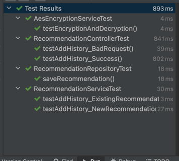

### 기술
- JAVA 11
- Spring Boot 2.7.12
- H2 DB
- 
### 요구사항 구현 여부
- 요청값이 유효할 경우 기록테이블(recommendation_history)에 내역을 기입합니다.
- 추천 상품 요청 API 호출 횟수 누적
  - 동일한 이메일 계정으로 호출 될 시, 숫자가 증가한다
- name 암호화 되어 저장됩니다.
- gender MALE, FEMALE, UNCHECKED 만 존재합니다.
  - 이외의 값이 요청 될 시 예외처리합니다.

### 실행 방법
1. h2를 실행합니다.
2. 브라우저에서 localhost:8080/h2-console로 접속합니다.
3. JDBC URL: jdbc:h2:mem:testdb, User Name: sa, Password: 없음
4. SpringBoot를 실행.
5. recommendation.http 추천상품 요청 API로 테스트.

### 검증 결과
AesEncryptionServiceTest -> 암호화 테스트
RecommendationControllerTest -> RecommendationController 테스트
RecommendationRepositoryTest -> RecommendationRepository 테스트
RecommendationServiceTest -> RecommendationService 테스트

